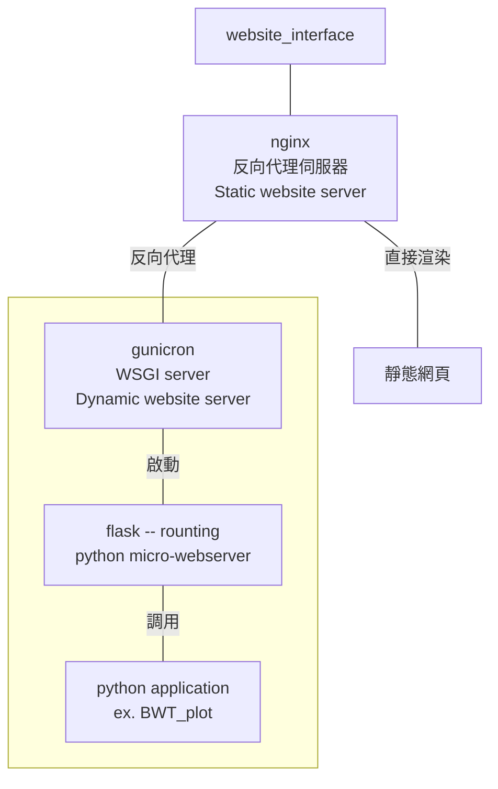

# Flask service with docker
---
## 目的
此專案主要目的是佈署 online python app 資料展演方案。

---
## 基本架構圖

---
## 檔案說明
* docker-compose.yaml : 就是docker-compose script檔 
* flask : 第二個服務，提供動態網頁
  + templates : 網頁模板
    - index.html
  + Dockerfile : flask docker描述檔，記錄此container生成步驟與規範
  + fstab : 掛載硬碟(NAS)
  + requirements.txt : 服務必要python lib，部分相依lib與高階lib，透過dockerfile安裝
  + Run_server.py : flask應用程式，請透過gunicron執行他
* nginx : 第一個服務，負責控管網頁入口與靜態網頁佈署
  + Dockerfile : nginx docker描述檔，記錄此container生成步驟與規範
  + nginx.conf : nginx 設定檔，修改 worker,user,include config path ...etc
  + project.conf : 反向代理設定
* volumne : 存放掛載文件夾
  + flask_lib : flask lib 文件夾
    - app.py : app.py

